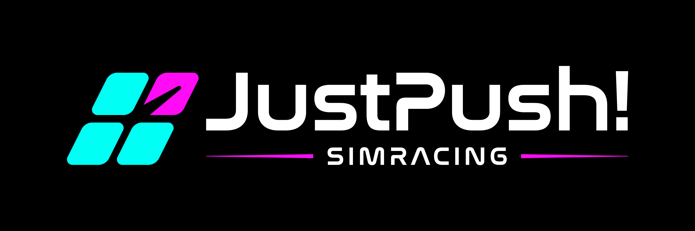
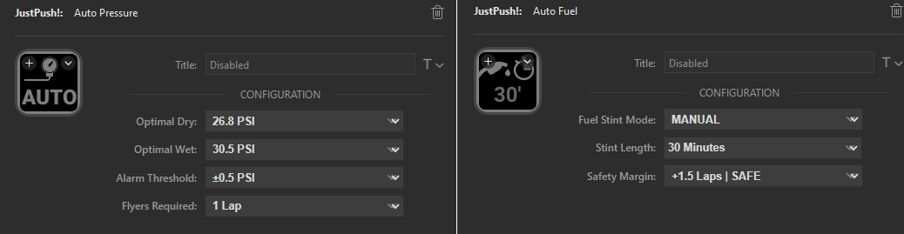
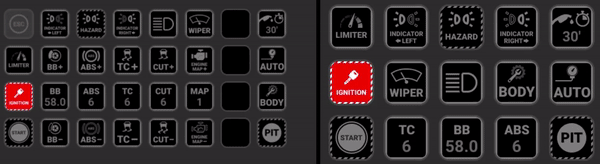
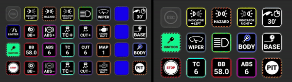
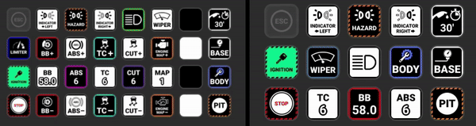
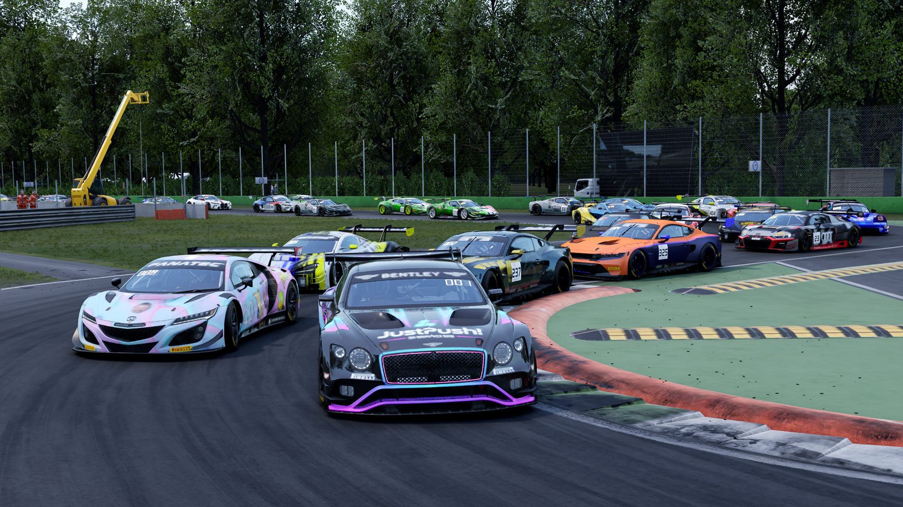

# JustPush! Plugin for Stream Deck
_Currently supported title: ACC | Planned supported titles: AC, AC Evo, LMU, iRacing_

**A revolutionary new plugin that will forever change the way you use your Stream Deck as a sim racing button box!**

#### Experience the thrill of perfect, effortless setups and pitstops with **Active Buttons** as your race engineer, with integrated tyre pressure and fuel calculators that do all the mental maths for you! 

Watch the video of Active Buttons in action to win P1 in the pits! 

But wait, there's more! A Stream Deck first--fully icon-integrated Flag Box! All packaged into perfect profiles, installed automatically with the plugin! 

Stunning start up sequences...

All race flags with no information loss...

Finish ahead of the pack with JustPush! 

## Navigation
- [Introduction](#introduction)
- [How to Get It](#how-to-get-it)
- [Installation](#installation)
- [Features](#features)
    - [Core Tier](#core-tier)
    - [Upgraded Tier](#upgraded-tier)
    - [Unlocked Tier](#unlocked-tier)
- [Support and Community](#support-and-community)
- [Roadmap](#roadmap)
- [Credits](#credits)

## Introduction
_**Transform your Stream Deck into the ultimate sim racing button box!**_

Forget fuel and pressure worries pre-race and mid-race in ACC. With Auto Fuel and Auto Pressure buttons, just turn a few laps to lock in perfect fuel and pressures for optimized setups and pitstops, regardless of setup type, track conditions, or driving style! It adapts to YOU, the driver, and the conditions you're driving in real time. Effortlessly manage fueling and pressure adjustments automatically—whether in the garage or pitstop MFD—so you can _just push_ on track! 

Forget dedicated flag buttons or flag overlays. Have all of your button icons and information available with integrated Flag Box, rendering flag colors underneath the icons, which has **never been done before** with Stream Deck button box solutions! 

***Don't Panic — Just Push!***

### Plugin Highlights:
- Active **Auto Fuel** and **Auto Pressure** buttons for effortless, perfect pitstops every time. 🤖🔧⛽
- First ever fully integrated **Flag Box**, dynamically rendering button icon backgrounds. 🏁
- Zero-config, customizable, preloaded profiles and buttons with stunning icons ⭐
- Robust, built-in macros to simplify and automate navigation of ACC UI and Pitstop MFD at lightning speeds. ⏱️
- Under constant development with community input, so you can help shape the future! 🚀

## How to Get it

**Free Version** 
Download the free version in GitHub [Releases](https://github.com/justpush-simracing/JustPush-Plugin/releases) ➡️.

**Premium Versions**  
Unlock additional features by joining the [JustPush! SimRacing Discord](https://discord.com/invite/She54PX85k) and subscribe to [JustPush! Patreon](https://www.patreon.com/c/justpushsimracing/membership) to access member channels:
- **Upgraded Tier**: €1/month
- **Unlocked Tier**: €3/month
___

❄️ _**HOLIDAY SEASON SPECIAL**_ ❄️

**JOIN [JUSTPUSH! SIMRACING DISCORD](https://discord.com/invite/She54PX85k) BEFORE NEW YEARS FOR FREE ACCESS TO UNLOCKED!**

## Installation
Installing the JustPush! plugin and profiles is a breeze with Stream Deck's software.

1. Download the `com.justpush.streamDeckPlugin` plugin file from [Releases](https://github.com/justpush-simracing/JustPush-Plugin/releases); double-click it to install plugin
3. Select `Install Profiles` to install the profiles (highly recommended for first installation), otherwise select `Cancel` to only install plugin (recommended for plugin updates only)
4. Set hotkeys and configure buttons (see [wiki on discord](https://discord.gg/thwjVvru6y))

You're all set! Go on track and just push!  
   
## Features

Features can be categorized by tier. The plugin versions are offered at three (3) different tiers with respectively affordable price-points.  

|Tier Name | Cost |
|-----:|-----------|
|[Core](#core-tier) | FREE |
|[Upgraded](#upgraded-tier)| €1/mo    |
|[Unlocked](#unlocked-tier)| €3/mo       |

### Core Tier
Core features are available for free and are consistent across all tiers. 

- Preloaded and user-configurable track and pitstop profiles, automatically installed with plugin
- Hotkeys for all car control electronics
  - Driver aids (ABS/BB/TC/TCC), Lights, Wipers, Ignition/Starter, Pit Limiter, etc.
- Multi-hotkey support for select controls:
  - Hazards (left+right signal), Wipers (auto-toggle rain lights)
- Flag display button (dedicated flag button--not integrated flag box) 
- Built-in macros for easily managing Pitstop MFD functions
  - User-defined fuel add/remove (incl. FULL and ZERO)
  - Select any/all tyres
  - User-defined pressure increase/decrease
  - Bodywork and Suspension repair toggles with **estimated repair times displayed**
  - Select driver, strategy
- Ignition-activated colors (i.e., turn on car to turn on buttons)
- Join the [JustPush! SimRacing Discord](https://discord.com/invite/She54PX85k) for:
  -  General support from the developer and community
  -  A community-based repository for free profiles that use JustPush! buttons
  
### Upgraded Tier
Upgraded features are available for a modest €1/month, providing an entry point into premium functionality with some limitations.

- Fully color-customizable icons (borders, activation backgrounds)
- Smart `open/close profile` buttons for effortless track and pitstop profile navigation
- Limited access to Active Buttons
  - Auto Fuel and Auto Pressure buttons will automatically calculate and _display_ recommendations while on track, but they can only be _applied_ in garage (setup menu).
- Membership to the Upgraded tier grants access to the Member channel in [JustPush! SimRacing Discord](https://discord.com/invite/She54PX85k) for:
  - Prioritized support from the developer and member community
  - Access to more frequently released stable builds than Core tier

### Unlocked Tier
Unlocked features include everything, now and forever into the future, providing complete access to the plugin’s capabilities for **ONLY** €3/month.

- **Fully unlocked Active Buttons**, displaying and applying changes both in garage and on track.
- **Integrated FlagBox**, which dynamnically renders the flag colors UNDER the icons—a first for Stream Deck!
- Membership to the Unlocked tier grants additional Member access to the [JustPush! SimRacing Discord](https://discord.com/invite/She54PX85k) for:
  - Priority access to new release builds
  - Early/beta access to pre-release builds
  - Direct interface with developers to request and test new features for future releases!
 
## Support and Community

Join the [**JustPush! SimRacing Discord**](https://discord.com/invite/She54PX85k) to:
- Get quick tips and support from the developer and community
- Access a growing repository of shared profiles
- Be the first to try new features and updates

Check out the [plugin wiki](https://discord.com/invite/thwjVvru6y) for every detail you could ever want, and then some! 

If you have an issue, please report it in the [issue tracker](https://github.com/justpush-simracing/JustPush-Plugin/issues) so we can learn and improve the product for you! 

## Roadmap
||Timeframe|Objective|
|----------|----------|----------|
|✅| Q1-Q3 2024 | Integrated test and development|
|✅| Q4 2024 | Closed beta test / Initial Release|
|⬜| Q1 2025 | Integrate AC & AC Evo|
|⬜| Q1/2 2025 | Integrate LMU & iRacing|
|⬜| Q3 2025 | Launch JustPush! Web Dash|

## Credits
- All buttons come preloaded with exquisite icons created by, and in collaboration with, THK84.
- Massive gratitude to [@Jowy](https://github.com/jowy) for backend/framework architecture, without whom this project would never have been possible. 
- The sim racing community for inspiring two sim racers with a simple idea, blossom into something we hope benefits the community that's given so much to us.
- Our loving families for supporting our expensive hobby and entrepreneurial aspirations.
