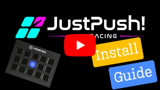

 &emsp;  &emsp;  &emsp;  &emsp;  
# JustPush! Plugin for Stream Deck
_Currently supported title: ACC | Planned supported titles: AC, AC Evo, LMU, iRacing_

**A revolutionary new plugin that will forever change the way you use your Stream Deck as a sim racing button box!** 

### Plugin Highlights ([full features here](#features))
- Active **Auto Fuel** and **Auto Pressure** buttons for effortless, perfect pitstops/setups every time. 🤖🔧⛽
- First ever fully integrated **Flag Box**, dynamically rendering button icon backgrounds. 🏁
- Zero-config, customizable, preloaded profiles and multi-state buttons with stunning hotkey icons ⭐
- Robust, built-in macros to simplify and automate navigation of ACC UI and Pitstop MFD at lightning speeds. ⏱️
- Under constant development with community input, so you can help shape the future! 🚀

Experience the thrill of precise, effortless setups and pitstops with **Active Buttons** as your race engineer, with live tyre pressure and fuel calculators that do all the mental maths--and make the changes--for you! 

Watch the video of Active Buttons in action to win P1 in the pits! 
***Don't Panic — Just Push!***

But wait, there's more...a Stream Deck first! **Fully icon-integrated Flag Box!** 

All of this and more is packaged into pre-configured profiles, installed automatically with the plugin in seconds. 

**Unlock your driving potential with JustPush now!**

## Navigation
- [Introduction](#introduction)
- [How to Get It](#how-to-get-it)
- [What is the Cost?](#what-is-the-cost)
- [Installation](#installation)
- [Features](#features)
- [Support and Community](#support-and-community)
- [Roadmap](#roadmap)
- [Credits](#credits)

## Introduction
_**Transform your Stream Deck into the ultimate sim racing button box!**_

Forget fuel and pressure worries pre-race and mid-race in ACC. With Auto Fuel and Auto Pressure buttons, just turn a few laps to lock in perfect fuel and pressures for optimized setups and pitstops _within seconds_, regardless of setup type, track conditions, or driving style! 

The optimal values adapt to YOU, the driver, and the conditions you're driving in real time. Effortlessly manage fueling and pressure adjustments automatically—whether in the garage or pitstop MFD—so you can _just push_ on track! 

Forget dedicated flag buttons or flag overlays. Have all of your button icons and information available with integrated Flag Box, rendering flag colors underneath the icons, which has **never been done before** with Stream Deck button box solutions! 

Stunning start up sequences...

All race flags with no information loss...

Finish ahead of the pack with JustPush! 

## How to Get it

You have a few options depending on what suits your preferences. The recommendation to 'set it and forget it' is to download from Marketplace, and if you want the latest as soon as it drops, then download from Discord.

1. Get it directly from [**Elgato Marketplace**](https://marketplace.elgato.com/product/justpush-a5096b0b-4d56-40bf-acbc-8cd4c33c545a). Note: You must have an Elgato Marketplace account (worth it).
   - Pro: Stays updated automatically.
   - Con: Will be up to two weeks delayed from newest release.

2. Download latest stable release from GitHub [**Releases**](https://github.com/justpush-simracing/JustPush-Plugin/releases).
   - Pro: Update stable builds when you want.
   - Con: No notification of updates (must check manually); up to a week delayed from newest release. 

3. Get new releases sooner by joining the [**JustPush! SimRacing Discord**](https://discord.gg/tew2neKXNw).
   - Pro: Beta and newest stable releases are here first, with notifications.
   - Con: Manual updates required. 

## What is the cost?

It's absolutely **FREE**! We want to give back to the community that has given us so much. We support other projects we believe in, and we hope you will do the same for this project. 

If you like what we've done and want us to keep pushing, keep us caffeinated by [**subscribing to our Patreon**](https://www.patreon.com/c/justpushsimracing/membership) or [**tipping via PayPal**](https://www.paypal.com/ncp/payment/6JF235HLX394C) ☕ 

## Installation
Installing the JustPush! plugin and profiles is a breeze with Stream Deck's software.

1. Download the `com.justpush.streamDeckPlugin` plugin file; double-click it to install plugin
3. Select `Install Profiles` to install the profiles (highly recommended for first installation), otherwise select `Cancel` to only install plugin (recommended for plugin updates only)
4. Confirm hotkeys and configure buttons (see [wiki on discord](https://discord.gg/thwjVvru6y))

You're all set! Go on track and just push!  

Please also watch our Install Guide video for this and more info! 
   
## Features

- Preloaded and user-configurable track and pitstop profiles, automatically installed with plugin
- Preconfigured (and user-configurable) Hotkeys for all car control electronics
  - Driver aids (ABS/BB/TC/TCC), Lights, Wipers, Ignition/Starter, Pit Limiter, etc.
- Multi-hotkey support for select controls:
  - Hazards (left+right signal), Wipers (auto-toggle rain lights)
- Flag display button (dedicated flag button--not integrated flag box) 
- Built-in macros for easily managing Pitstop MFD functions
  - User-defined fuel add/remove (incl. FULL and ZERO)
  - Select any/all tyres
  - User-defined pressure increase/decrease
  - Bodywork and Suspension repair toggles with **estimated repair times displayed**
  - Select driver, strategy
- Ignition-activated colors (i.e., turn on car to turn on buttons)
- Fully color-customizable icons (borders, activation backgrounds)
- Smart `open/close profile` buttons for effortless track and pitstop profile navigation
- **Active Buttons** for auto fuel and auto pressure, displaying and applying optimal changes both in garage and on track
   - Auto Fuel: Real-time fuel calculator and more! Use Manual mode to specify a length, or let Dynamic mode do everything for you! 
   - Auto Pressure: Real-time pressure calculator and more! Nail your pitstop and/or setup tyre pressures every single time with a single push of a button! 
- **Integrated FlagBox**, which dynamnically renders the flag colors UNDER the icons—a first for Stream Deck!

- Join the [JustPush! SimRacing Discord](https://discord.gg/tew2neKXNw) for:
  - Fast support from community/developer
  - First access to new release builds
  - Early/beta access to pre-release builds
  - Direct interface with developers to request and test new features for future releases!
 
## Support and Community

Join the [**JustPush! SimRacing Discord**](https://discord.gg/tew2neKXNw) to:
- Get quick tips and support from the developer and community
- Access a growing repository of shared profiles
- Be the first to try new features and updates

Check out the [plugin wiki](https://discord.com/invite/thwjVvru6y) for every detail you could ever want, and then some! 

If you have an issue, please report it in the [issue tracker](https://github.com/justpush-simracing/JustPush-Plugin/issues) so we can learn and improve the product for you! 

## Roadmap
||Timeframe|Objective|
|----------|----------|----------|
|✅| Q1-Q3 2024 | Integrated test and development|
|✅| Q4 2024 | Closed beta test / Initial Release|
|✅| Q1 2025 | Publish on Elgato Marketplace|
|⬜| Q1 2025 | Integrate AC & AC Evo|
|⬜| Q1/2 2025 | Integrate LMU & iRacing|
|⬜| Q3 2025 | Launch JustPush! Web Dash|

## Credits
- All buttons come preloaded with exquisite icons created by, and in collaboration with, THK84.
- Massive gratitude to [@Jowy](https://github.com/jowy) for backend/framework architecture, without whom this project would never have been possible. 
- The sim racing community for inspiring two sim racers with a simple idea, blossom into something we hope benefits the community that's given so much to us.
- Our loving families for supporting our expensive hobby and entrepreneurial aspirations.
